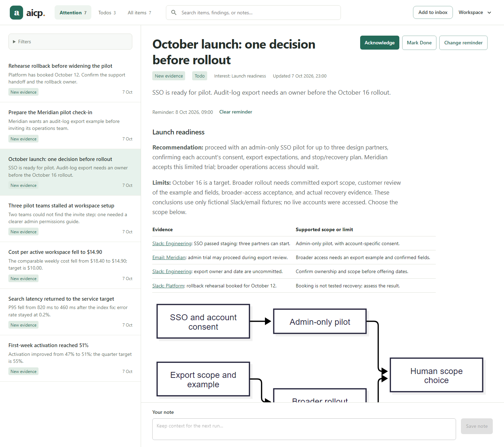
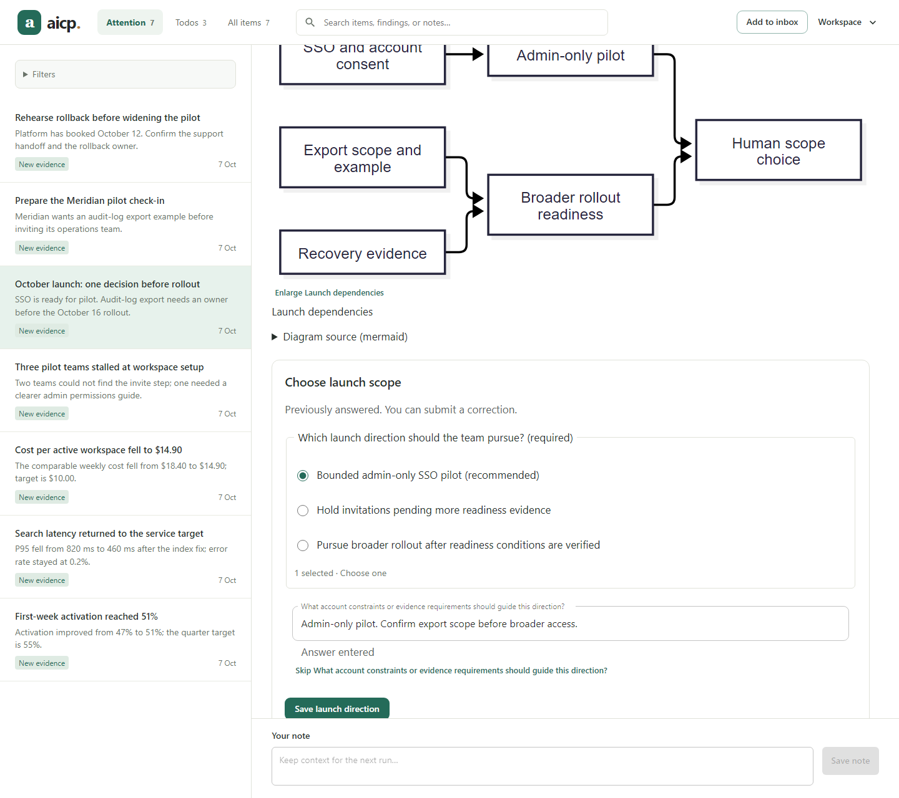

# Agent-first product-team demo

The story begins with the person asking an agent to install aicp, then telling
it what to look after. The agent configures Interests and Watchers, inspects
Slack and email evidence, advances a continuing matter through delegation, and
delivers rich output for human review. The person supplies a material decision;
the next agent visit can read that answer and continue.

Use the short [install and interest prompts](../examples/install-prompt.md).
The film shows these as example prompts, followed by recorded app output and
operation facts. Installation is described through the agent, rather than a
manual portal setup tutorial.

Northstar source messages, names, and metrics are **fictional local fixtures**;
no live Slack account, email account, or analytics service was accessed.



The workspace contains seven Items across three Interests:

| Interest | Findings |
| --- | --- |
| Launch readiness | Launch review with an unresolved owner; rollback rehearsal |
| Customer onboarding | Repeated setup friction; activation trend; pilot check-in |
| Service health & cost | Search latency recovery; cost per active workspace |

The first Run saves the baseline. A returning Run updates the same activation
Outcome from 47% to 51%, retaining Item identity and user state. The agent
records a pending launch-scope handoff on the existing launch Item; an executor
publishes a report with an evidence table, Mermaid dependencies, and a structured
scope question. The primary reviews the result before closing the handoff.

The capture includes a fictional reviewer choosing an admin-only pilot and
saving constraints. A subsequent agent Item read retrieves the answer and
retains it as continuation context; this leaves the answer applicable and
preserves Todos, reminders, acknowledgements, and user notes. Three Items have
open Todos, and the launch review has a reminder.



The current recording used an actual session-scoped executor, including a
same-executor presentation repair. The portable replay below imports its sample
report and labels the handoff as illustrated; it does not launch an executor.

## Recreate the workspace

Build the executable as described in the [README](../README.md#try-the-demo-or-build-from-source).
Stop your existing server first: aicp uses the fixed loopback port 7331.
From the repository root, start a separate workspace in one terminal:

```powershell
.\dist\aicp.exe serve --data-dir .\test-output\showcase
```

In a second terminal:

```powershell
.\scripts\showcase.ps1
.\scripts\showcase-work.ps1 -Phase prepare
.\scripts\showcase-work.ps1 -Phase illustrate
```

The seed script requires an empty workspace and refuses to modify one that
already contains Interests, Watchers, Items, Runs, or Proposals. For a second
fresh demo, choose a different data-directory path. The database stays in the
ignored `test-output/` directory and remains available for later demos.

`prepare` reads the local [Slack](../examples/showcase/slack-launch.md),
[email](../examples/showcase/email-pilot.md),
[metrics](../examples/showcase/weekly-metrics.md), and
[service](../examples/showcase/service-review.md) fixtures, completes a returning
inspection, and records a pending handoff. `illustrate` imports the portable
[executor report](../examples/showcase/launch-report.json) and marks its
continuation as a fictional replay. It refuses to replace an actual executor
reference. An agent can instead dispatch the pending task through its own tools,
following the [handoff contract](../examples/delegation-handoff.md).

Open <http://127.0.0.1:7331> and select **October launch: one decision before
rollout** in Attention. Visit Todos, All items, Monitoring, and Activity to
explore the same data. Source URLs use `example.com` as placeholders.

## Refresh the screenshot

Install Playwright's browser if it is not available, then capture the running
demo at a 1440 × 1280 viewport:

```powershell
npx --prefix web playwright install chromium
node scripts/capture-showcase.mjs
```

The capture script selects the launch report, checks that the seven fictional
Items are present, and saves `docs/images/aicp-attention.png` and
`docs/images/aicp-review.png`. It captures the
rendered application without changing its styling or substituting content.
Check the saved image before using it in a presentation. Stop the demo server
with Ctrl+C when finished; restart your normal server with its usual data path.
